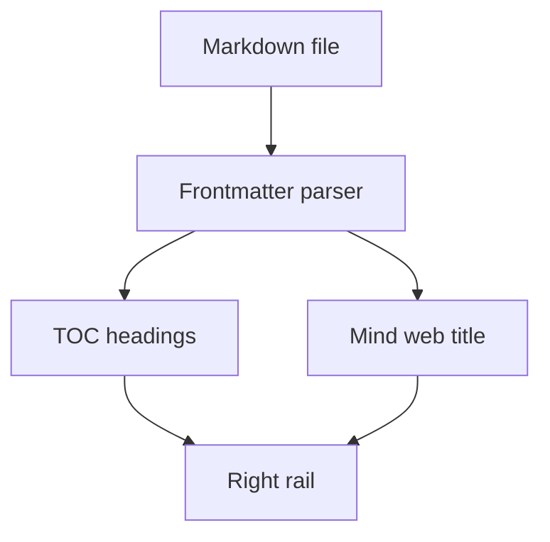
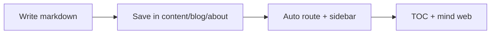

<video controls src="/vengeance-adding-blog-demo.mp4"></video>

## This can be your About

Use this page as your own About section. Replace this text with your bio, work summary, stack, and links. To add posts, see [Adding a New Blog](/about/adding-a-new-blog). For Obsidian sync, see [Push from Obsidian to Vengeance](/about/obsidian-push-guide) and [Pull from Vengeance into Obsidian](/about/obsidian-pull-guide).

## What you get

This template reads markdown files from `content/blog/**.md` and automatically wires:

- route path from folder/file name
- right TOC progress rail from `##` / `###` headings
- mind web node title from frontmatter `title`

## Folder routing

File:

```txt
content/blog/about/about-template.md
```

Route:

```txt
/about/about-template
```

### Frontmatter fields

Use this frontmatter schema:

```yaml
---
title: "Post title"
description: "One-line summary"
author: "Your name"
inspiredBy: "Source or reference"
date: "2026-07-24"
readingTime: "6 min" # optional, auto-calculated if omitted
isNew: true          # optional
thumbnail: "/my-cover.png" # optional — cover image + link preview card
---
```

Link to other posts with markdown routes in the **blog repo**, e.g. `[How Browsers Work](/frontend/how-browsers-work)`. Those render as clickable links on the site. On **Obsidian pull**, the vault copy becomes `[[how-browsers-work]]` for the Obsidian graph. On **push**, wikilinks become blog routes again. Set `NEXT_PUBLIC_SITE_URL` so absolute links convert correctly too.

## Rich markdown

### Image:


## Mermaid diagram



### Flow diagram sample


