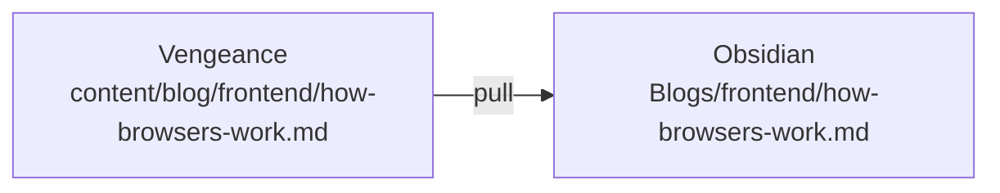
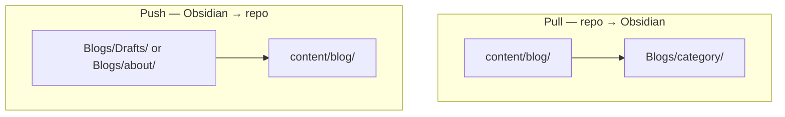

 → 

## In one line

The blog already has posts in git. Pull copies them into your **Obsidian** vault for editing.



## Example walkthrough

**1. A post already exists in the repo:**

```txt
content/blog/frontend/how-browsers-work.md
```

**2. Pull it into Obsidian:**

```powershell
npx tsx scripts/sync-obsidian.ts pull "frontend/how-browsers-work.md"
```

**3. Edit the copy in your vault** at `Blogs/frontend/how-browsers-work.md` — no internal sync metadata, just clean markdown.

**4. Push your edits back** (see the push guide):

```powershell
npx tsx scripts/sync-obsidian.ts push "Blogs/frontend/how-browsers-work.md"
```

## Pull everything at once

```powershell
npm run sync:pull
```

Scans all of `content/blog/` and mirrors each file to `Blogs/<category>/<slug>.md`.

Safe to re-run — unchanged files are skipped.

## Path pattern

```txt
content/blog/frontend/example-post.md  →  Blogs/frontend/example-post.md
content/blog/about/your-page.md        →  Blogs/about/your-page.md
```

## Push vs pull



| | Pull | Push |
|---|------|------|
| Direction | repo → vault | vault → repo |
| Bulk command | `npm run sync:pull` | `npx tsx scripts/sync-obsidian.ts push` |

**Tip:** `Blogs/Drafts/` is for brand-new posts. Pulled posts live under `Blogs/frontend/`, `Blogs/about/`, etc.

## Check what's in the repo

```powershell
npm run sync:status
```

Look for: `Blog posts in content/blog/: <count> (...)`
