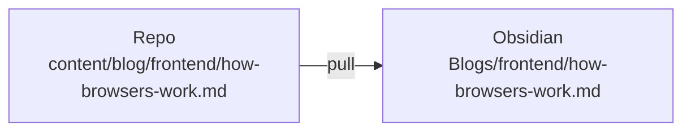

## Setup first

Before pull works, copy the example config and point it at **your** vault:

```powershell
copy .vengeance\config.example.json .vengeance\config.json
```

Then edit `.vengeance/config.json`:

- **`vaultPath`** — absolute path to your Obsidian vault
- **`obsidianBlogRoot`** — folder where pulled posts go (default: `Blogs`)
- **`mappings`** — needed if you push edits back from Obsidian

Example:

```json
{
  "vaultPath": "C:/Users/you/Documents/MyVault",
  "obsidianBlogRoot": "Blogs",
  "mappings": [
    {
      "obsidianFolder": "Blogs/Drafts",
      "blogCategory": "frontend",
      "direction": "bidirectional"
    }
  ]
}
```

This file is gitignored — it stays on your machine only.

<p align="center">

 → 

</p>

## How pull works



The `Blogs/` prefix comes from `obsidianBlogRoot` in your config.

## Example

**Repo has:**

```txt
content/blog/frontend/how-browsers-work.md
```

**You run:**

```powershell
npx tsx scripts/sync-obsidian.ts pull "frontend/how-browsers-work.md"
```

**Obsidian gets** `Blogs/frontend/how-browsers-work.md` — with `[[how-browsers-work]]` wikilinks for the Obsidian graph. The blog repo keeps markdown links like `[How Browsers Work](/frontend/how-browsers-work)` for the website.

**Edited something?** Push it back:

```powershell
npx tsx scripts/sync-obsidian.ts push "Blogs/frontend/how-browsers-work.md"
```

## Pull everything

```powershell
npm run sync:pull
```

Mirrors all of `content/blog/` → `Blogs/<category>/`. Safe to re-run.

## Push vs pull

| | Pull | Push |
|---|------|------|
| Direction | repo → Obsidian | Obsidian → repo |
| One file | `tsx ... pull "frontend/post.md"` | `tsx ... push "Blogs/Drafts/post.md"` |
| All files | `npm run sync:pull` | `npx tsx scripts/sync-obsidian.ts push` |

**Tip:** New drafts → `Blogs/Drafts/`. Pulled posts → `Blogs/frontend/`, `Blogs/about/`, etc. For push workflow details, see [Push from Obsidian to Vengeance](/about/obsidian-push-guide).

## Check counts

```powershell
npm run sync:status
```
