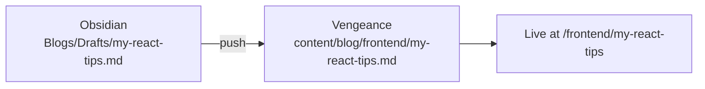

 → 

## In one line

You write a note in **Obsidian**. Push sends it to **Vengeance** as a file under `content/blog/`.



## Example walkthrough

**1. Write this note in Obsidian** at `Blogs/Drafts/my-react-tips.md`:

```markdown
---
title: My React Tips
description: Three hooks I use every day
date: 2026-08-26
---

## useMemo

Only when profiling shows a real cost.

## useCallback

For stable props to memoized children.
```

**2. Run push** from the repo root:

```powershell
npx tsx scripts/sync-obsidian.ts push "Blogs/Drafts/my-react-tips.md"
```

**3. What you get in the repo:**

```txt
content/blog/frontend/my-react-tips.md
```

Open `/frontend/my-react-tips` in the dev server — done.

## Where to write in Obsidian

Push only reads **mapped folders** in `.vengeance/config.json`:

| Obsidian folder | Becomes blog category |
|-----------------|----------------------|
| `Blogs/Drafts/` | `frontend` |
| `Blogs/about/` | `about` |

New draft? Use `Blogs/Drafts/`. About page? Use `Blogs/about/`.

## Push all mapped notes at once

```powershell
npx tsx scripts/sync-obsidian.ts push
```

## Check before pushing

```powershell
npm run sync:status
```

Shows your vault path, how many notes are waiting, and blog post counts.
