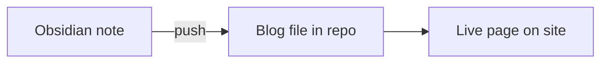

<div align="center" style="display:flex;align-items:center;justify-content:center;gap:16px;padding:8px 0 24px;">
  
  <span style="font-size:28px;color:#a1a1aa;">→</span>
  
</div>

## In one line

Write in **Obsidian**, push once, the note lands in **Vengeance** as a blog file.



## Example

**You write** `Blogs/Drafts/my-react-tips.md` in Obsidian:

```markdown
---
title: My React Tips
description: Three hooks I use every day
---

## useMemo
Use when profiling shows a real cost.
```

**You run:**

```powershell
npx tsx scripts/sync-obsidian.ts push "Blogs/Drafts/my-react-tips.md"
```

**You get** `content/blog/frontend/my-react-tips.md` → open `/frontend/my-react-tips`.

## Where to write

| Obsidian folder | Goes to |
|-----------------|---------|
| `Blogs/Drafts/` | `content/blog/frontend/` |
| `Blogs/about/` | `content/blog/about/` |

Set these in `.vengeance/config.json` under `mappings`.

## Commands

```powershell
npm run sync:status                                              # check vault + counts
npx tsx scripts/sync-obsidian.ts push "Blogs/Drafts/note.md"    # one file
npx tsx scripts/sync-obsidian.ts push                           # all mapped folders
```
