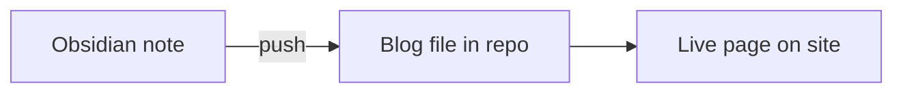

<div align="center" style="display:flex;align-items:center;justify-content:center;gap:10px;padding:4px 0 16px;">
  
  <span style="font-size:18px;color:#a1a1aa;">→</span>
  
</div>

## Setup first

Before push or pull works, copy the example config and point it at **your** vault:

```powershell
copy .vengeance\config.example.json .vengeance\config.json
```

Then edit `.vengeance/config.json`:

- **`vaultPath`** — absolute path to your Obsidian vault
- **`mappings`** — which Obsidian folders map to which blog categories
- **`obsidianBlogRoot`** — where pulled posts land in the vault (default: `Blogs`)

Example:

```json
{
  "vaultPath": "C:/Users/you/Documents/MyVault",
  "mappings": [
    {
      "obsidianFolder": "Blogs/Drafts",
      "blogCategory": "frontend",
      "direction": "bidirectional"
    }
  ],
  "obsidianBlogRoot": "Blogs"
}
```

This file is gitignored — it stays on your machine only.

## In one line

Write in **Obsidian**, push once, the note lands in **Vengeance** as a blog file.



## Example

**You write** `Blogs/Drafts/my-react-tips.md` in Obsidian:

```markdown
---
title: My React Tips
description: Three hooks I use every day
---

## useMemo
Use when profiling shows a real cost.
```

**You run:**

```powershell
npx tsx scripts/sync-obsidian.ts push "Blogs/Drafts/my-react-tips.md"
```

**You get** `content/blog/frontend/my-react-tips.md` → open `/frontend/my-react-tips`.

## Where to write

| Obsidian folder | Goes to |
|-----------------|---------|
| `Blogs/Drafts/` | `content/blog/frontend/` |
| `Blogs/about/` | `content/blog/about/` |

Those folders must match what you set in `mappings` inside `.vengeance/config.json`.

## Commands

```powershell
npm run sync:status                                              # check vault + counts
npx tsx scripts/sync-obsidian.ts push "Blogs/Drafts/note.md"    # one file
npx tsx scripts/sync-obsidian.ts push                           # all mapped folders
```
